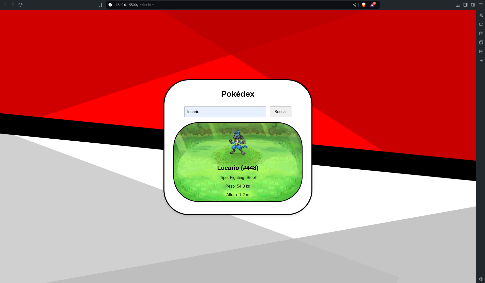

# Pokédex Web Application
## Description
This is a simple Pokédex web application developed using HTML, CSS, and JavaScript. It leverages the PokéAPI to fetch and display information about Pokémon. Users can search for Pokémon by name, view details such as type, weight, height, and image. The application also filters the Pokémon list in real-time as the user types, displaying the results within a scrollable container to maintain a fixed layout.



## Features
Search by Name: Search for any Pokémon by entering its name in the search bar.
Detailed View: View detailed information about the selected Pokémon, including its image, type, weight, and height.
Filtered List: As the user types in the search bar, a filtered list of Pokémon that start with the entered letters is displayed.
Scrollable Container: The Pokémon list is displayed in a scrollable container, preventing the page layout from expanding.

## Technologies Used
- HTML: Provides the basic structure of the application.
- CSS: Handles the styling of the interface, including the responsive layout and the design of the scrollable container.
- JavaScript: Manages DOM manipulation, integrates with the PokéAPI, and implements the logic for searching and displaying Pokémon.
- PokéAPI: An external API used to fetch Pokémon data.

## How It Works
- Search by Name: The user can enter a Pokémon's name in the search bar. Upon clicking the search button or pressing "Enter," the application sends a request to the PokéAPI to retrieve the corresponding Pokémon.

- Real-Time Filtering: As the user types in the search bar, the Pokémon list is filtered in real-time, showing only those whose names start with the entered letters. The results are displayed in a fixed-size, scrollable container.

- Display Pokémon Details: When a Pokémon from the filtered list is clicked, detailed information about that Pokémon is displayed in the main container.

## Installation and Setup
To run this project locally, follow these steps:

Clone the repository:
``` bash
git clone https://github.com/zeeesoares/pokedex.git
```

Navigate to the project directory:
``` bash
cd pokedex
```

Open index.html in your preferred web browser to view the application.

# Acknowledgements
- Thanks to PokéAPI for providing the Pokémon data.
- Inspiration from the original Pokémon games.
